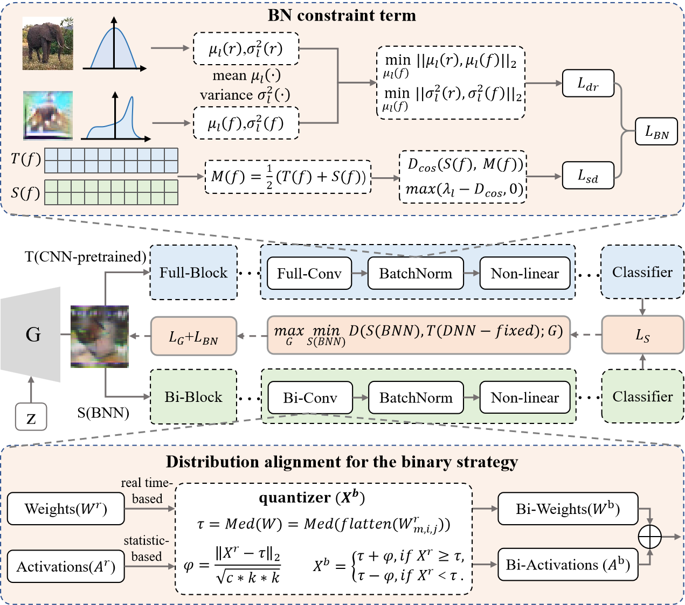

# Zero-shot Binarization Lightweight Model for a Data-free Edge Network (ZS-BNN)
This project is the PyTorch implementation of our paper

## The overview of our method   

## Dependencies
* Ubuntu == 18.04
* GPU == NVIDIA V100
* GPU Driver == 535.183.01
* CUDA == 12.1
* Python == 3.9
* Pytorch == 2.2.0
* torchvision == 0.17.0

## Accuracy
CIFAR-10:
 
 Model  | 	Bit-Width (W/A)  | Top-1 Acc. (%)
 ---- | ----- | ------  
 ResNet-18  | 1/32 | 92.2 
 ResNet-18  | 1/1 | 81.4 
 VGG-Small  | 1/32 | 85.7 
 VGG-Small  | 1/1 | 80.0 
 
CIFAR-100:
 
 Model  | 	Bit-Width (W/A)  | Top-1 Acc. (%)
 ---- | ----- | ------  
 ResNet-18  | 1/32 | 70.4 
 ResNet-18  | 1/1 | 50.8
 
 Caltech-101:
 
 Model  | 	Bit-Width (W/A)  | Top-1 Acc. (%)
 ---- | ----- | ------  
 ResNet-18  | 1/32 | 76.0 
 ResNet-18  | 1/1 | 72.1
 ResNet-34  | 1/32 | 75.2 
 ResNet-34  | 1/1 | 73.5

 
 ## Citation
 If you find our code useful for your research, please consider citing:  
 Zeng K, Gu H, Duan Y, et al. Zero-shot Binarization Lightweight Model for a Data-Free Edge Network[J]. IEEE Transactions on Cognitive Communications and Networking, 2025.
 [https://ieeexplore.ieee.org/abstract/document/11003142](https://ieeexplore.ieee.org/abstract/document/11003142) 